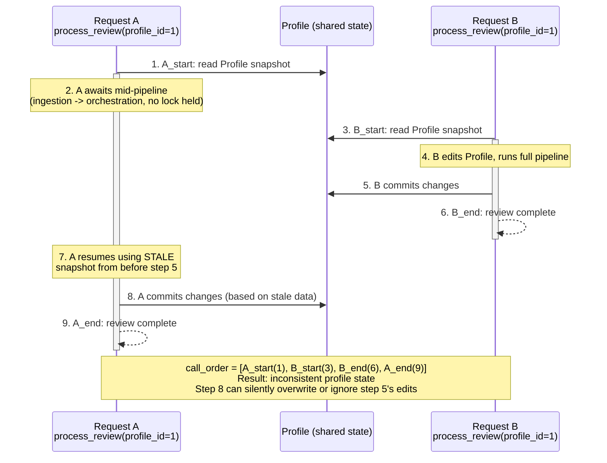

# Solution Plan

**Issue link:** [https://github.com/ascherj/pathreview/issues/82]

**Issue title:** [Concurrent review requests for the same profile can produce inconsistent results - #82]

## Issue Visualization

**What the diagram shows:** Request A begins first and holds an in-memory `Profile` snapshot across several `await` points (ingestion, orchestration, RAG, safety checks). Since nothing keys off `profile_id`, Request B is free to start, run to completion, and commit its own changes while A is still suspended mid-pipeline. When A eventually resumes and commits, it does so against its now stale snapshot, producing the interleaved `["A_start", "B_start", "B_end", "A_end"]` order the regression test asserts against. A per-profile lock would force B to wait until A releases the lock, guaranteeing one of the two non-interleaved orders instead.

## Understand

**Root cause:** `process_review()` in `core/services/review_service.py` fetches a `Profile` snapshot, then runs a multi-step pipeline (ingestion, agent orchestration, RAG, safety checks) with several `await` points and `db.commit()` calls in between. Nothing keys off `profile_id`, so two concurrent calls for the same profile interleave freely against shared profile state instead of being serialized.

**Expected behavior:** A second review request for a profile that already has a review in progress should wait for the first to finish before it starts, so the two loops never straddle each other.

**Actual behavior:** Both loops run concurrently. One loop can commit changes based on a stale snapshot read before the other loop's edits landed, producing inconsistent review results. The regression test at `tests/integration/test_review_concurrency.py` confirms this: on unfixed code, `call_order` comes back as `["A_start", "B_start", "B_end", "A_end"]` instead of one loop fully finishing before the other starts.

## Map

- `core/services/review_service.py`, `process_review()`: needs to acquire a per-profile lock before running the pipeline and release it once the review reaches a terminal status (complete or failed).
- `core/services/review_service.py`, module level: needs a registry mapping `profile_id` to an `asyncio.Lock`, since locks must be shared across the concurrent background tasks running in the same process.
- `api/routes/reviews.py`, `create_review_endpoint()`: no change to endpoint response behavior. It already returns immediately with status "pending" and schedules `process_review` via `background_tasks.add_task`, so the lock only needs to live inside `process_review`, not the endpoint.
- `tests/integration/test_review_concurrency.py`: existing regression test, used as the pass/fail baseline. No changes expected.

## Plan

1. Add a module level per-profile lock registry in `review_service.py`, an `asyncio.Lock` per `profile_id`, created lazily and reused across calls.
2. Wrap the body of `process_review()` (from status set to "processing" through the terminal status commit) in `async with` the profile's lock, so a second call for the same `profile_id` blocks until the first releases it.
3. Make sure the lock is released on every exit path, including the existing exception handler that marks the review "failed", so a failure in one loop cannot deadlock a later request for the same profile.
4. Run the regression test against the fix and confirm `call_order` comes back as one of the two non-interleaved orders.
5. Run `make check` and `make test-unit` per CONTRIBUTING.md before opening the PR.

## Inputs & Outputs

Input: the existing regression test's two concurrent `process_review()` calls for the same `profile_id`, one slowed down mid-ingestion to simulate real fetch latency, the other editing the profile and submitting while the first is still in flight.

Output: `call_order` must equal `["A_start", "A_end", "B_start", "B_end"]` or `["B_start", "B_end", "A_start", "A_end"]`, per the "Expected result once fixed" section in JOURNAL.md. No change to the review's external API contract, `create_review_endpoint()` still returns "pending" immediately.

## Risks, Unknowns, and Limitations

The lock must live at module scope, not per request or per session, otherwise two calls in different background tasks would each get their own lock and never actually serialize. Since `process_review` runs as a FastAPI background task in the same process, an in-memory `asyncio.Lock` keyed by `profile_id` is sufficient for now, but it will not hold across multiple worker processes or machines. If the app is ever deployed with multiple workers, this needs to move to a distributed lock (for example Postgres advisory locks, since Postgres is already the datastore). Flagging this as a known limitation rather than solving it now keeps the fix scoped to #82.

A second risk is a surface level patch that only satisfies the test's exact timing without actually serializing the pipeline, for example locking only around the ingestion step instead of the whole pipeline. The lock needs to wrap the entire `process_review` body so downstream agent orchestrator state for a given profile is never touched by two runs at once.

The lock registry itself could grow unbounded over the life of the process since locks are never removed once created. Not fixing this now since it is a small memory footprint per profile and out of scope for #82, but worth flagging.

## Edge Cases

Verify the fix holds as the two loops' timing windows narrow toward zero overlap, not just the specific 0.2s and 0.05s sleep values in the current test, since the lock should serialize regardless of exact timing.

Verify there is no check then act gap between checking whether a profile's lock is held and actually acquiring it. Creating the lock lazily with a plain dict lookup is only safe because `asyncio.Lock()` construction and the dict assignment happen without an intervening await, so two coroutines can't race into creating two different locks for the same profile_id.

Verify the new lock cannot deadlock. Since each profile has exactly one lock and `process_review` never awaits another profile's lock while holding its own, there is no lock ordering cycle possible. Also confirm the lock is released even when the pipeline raises partway through, covered by the existing try/except in `process_review`.

Confirm a third, fourth, etc. concurrent request for the same profile queues correctly rather than just the two request case the test covers.
